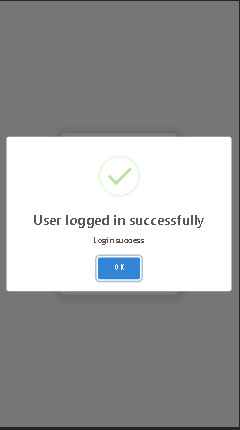
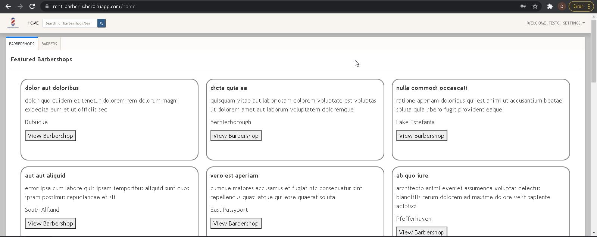
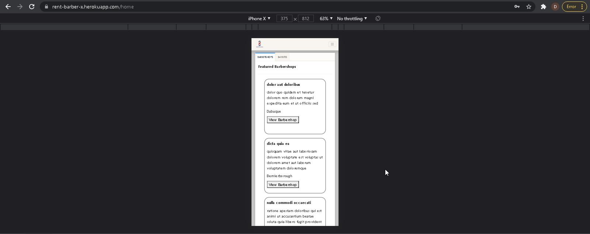
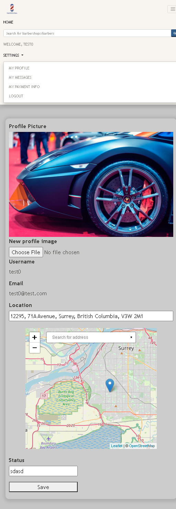
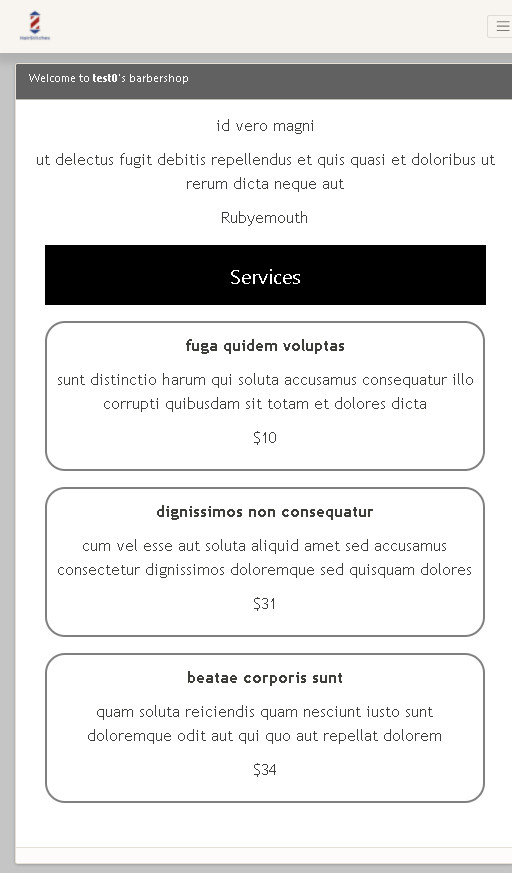
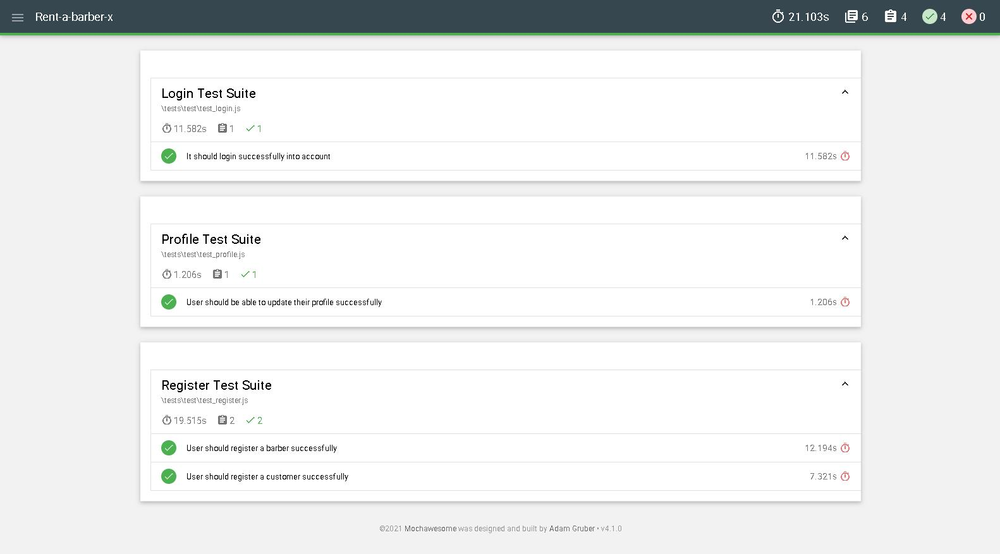

# 💈Rent a Barber X💈

> Barbershops Services Portal

## Features

- User Registration (as a barber or a customer)
- Handlebars and jQuery Frontend
    * Barbershop & Services page creation
    * Barbershop location (leaflet.js map)
    * Internal chat system (socket.io)
    * Bootstrap 4 & Custom Responsive CSS
- Express & MongoDB Backend
    * User Authentication & Authorization (JWT)
    * Search functionality filter
- MongoDB Scripts (Seeding, Importing, Exporting, Managing Collections)
- Unit Tests: Mocha & Chai
- Functional Tests: Selenium Webdriver (JS)
    * POM pattern 
    * Mochawesome Automation Reports
    
---

## Screenshots

##### User Authentication

##### Homepage - List of Barbers/barbershops

##### Homepage (mobile)

##### Profile page (mobile)

##### Barbershop services (mobile)

#### Test Suite Reports

---

## Installation Instructions
##### 1. Install all dependencies
npm install
##### 2. Compile assets (webpack - js)
npm run webpack-watch
##### 3. Compile assets (sass - css)
npm run scss:watch
##### 4. Run the app (express + mongodb backend)
npm run node-dev
##### 5. Go to http://localhost:3002/login to get started
##### 6. MongoDB
    -Import data: 
        -All collections from latest export:
            node ./database/scripts/import-all-latest-dir.js
        -All collections from a selected timestamp export:
            node ./database/scripts/import-all-selected-dir.js
        -Some collections from latest export:
            node ./database/scripts/import-filter-latest-dir.js
        -Some collections from selected timestamp export:
            node ./database/scripts/import-filter-selected-dir.js
    -Export data: 
        -From All collections:
            node ./database/scripts/export-all-collections.js
        -Some collections:
            node ./database/scripts/export-filter-collections.js
    -Seed (generate) data:
        node ./database/scripts/seed-[barbershops|users].js
    -Drop database:
        node ./database/scripts/drop-database.js
    -Delete collections:
        -Delete all collections:
            node ./database/scripts/delete-all-collections.js
        -Delete some collections:
            node ./database/scripts/export-filter-collections.js
            
#####   Run Test Cases (Requires Firefox 89.0.2): 
	npm run test_login
	npm run test_register
	npm run test_profile
	npm run test_regression_reports